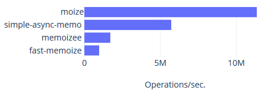

[](https://travis-ci.org/s-h-a-d-o-w/simple-async-memo)
[](https://www.npmjs.com/package/simple-async-memo)
[](https://opensource.org/licenses/MIT)

# simple-async-memo

A minimalist, reasonably fast (see [alternatives below](#alternatives)) memoization
library with lazy cache renewal specifically for Promise-based usage.

## Why?

With long running fetches/operations, it may be desirable to always get the cache immediately
and update it silently in the background. So that the user never has to wait.

While there are already dozens of memoization libraries out there, at least I couldn't
find one that supports this behavior. Please let me know if there actually is one that's
already more established than this one.

## General behavior

Rejection is generally considered an unacceptable result. Hence, whenever the cache is being
refreshed (either the initial call or on cache expiration - see `maxAge`),
simple-async-memo will keep retrying on rejection (the interval at which this happens can be
customized - see `rejectRetryDelay`).

If the initial call already results in rejection, it will still be returned though.

## Installation

```bash
yarn add simple-async-memo
```

## Example

```js
const {memoize} = require('simple-async-memo');

function fn(arg1, arg2) {
    return fetch('...');
}

const memoized = memoize(fn); // fn HAS to return a Promise!

memoized('foo', 'bar')
    .then(...)
    .catch(...);
memoized('foo', 'bar')
    .then(...)
    .catch(...);
```

## Options

### `maxAge`

**Default: MAX_SAFE_INTEGER \* 0.5**

So by default, the cache doesn't expire.

### `rejectRetryDelay`

**Default: 10000 ms**

This does not mean that `simple-async-memo` keeps retrying by itself. Instead, if you e.g. call a function regularly every 200 ms and you set this delay to 500 ms, if
the initial call failed, `simple-async-memo` will not retry for the first 2 calls but only the 3rd. IF that one succeeds, the cache will be updated lazily - meaning, only
the 4th call will get the resolved value.

### `matchesKey: (any[], any[]) => boolean`

**Default: shallow comparison of all array elements**

## Benchmark & Alternatives <a name="alternatives"></a>

You can run the benchmark by cloning this repo and doing `npm run benchmark`.

The basis is a function that takes two arguments and returns a Promise. For those
libraries that support it, the "promise" flag was set.

| Name              | Ops/sec.   | Relative margin of error | Sample size |
| ----------------- | ---------- | ------------------------ | ----------- |
| moize             | 11,354,469 | ± 1.04%                  | 81          |
| simple-async-memo | 5,717,515  | ± 0.65%                  | 85          |
| memoizee          | 1,707,028  | ± 1.83%                  | 79          |
| fast-memoize      | 971,844    | ± 0.74%                  | 86          |



[Moize](https://github.com/planttheidea/moize) offers great performance and has async options but unfortunately no lazy cache renewal. And its architecture is structured in a way that doesn't allow for contributing such a feature easily. (If this changes, let me know. 😉)
